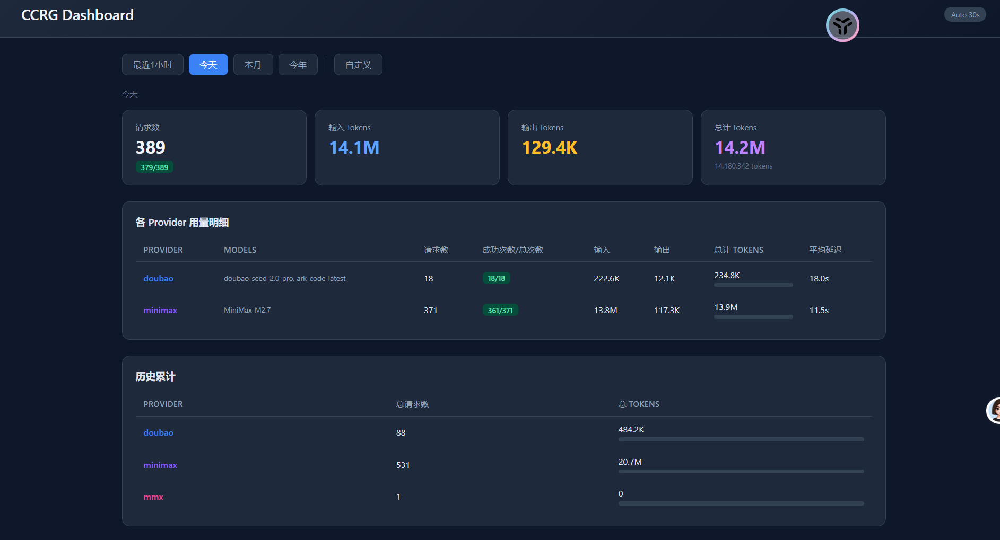

# Claude Code Router Gateway (CCRG)

极薄的 AI 请求网关，支持在同一 agent loop 内根据请求特征动态路由到不同 provider。



## 解决的问题是：
1.命中codeplan 套餐
2.分流token 不同的模型做不同的事情

### 伪工作流
CCRG 不用当「大脑」，只当「指挥 + 分流管道」
扁平化命中机制。内部不做流程，而是摊开分流。
去命中providers，但是claude code cli 能流式响应的效果。

[README.md](gateway_exsample/README.md)
### 尽量让每个 provider 都能流式响应。
claude code cli 一次请求，CCRG 也只发出一个请求（除了fallback 和失败重试的的等兜底）

## 起因：rr
minimax 2.7 太笨了，但是便宜
## 特性

- **智能路由**: 按 scenario / tool 类型 / 关键词做请求分类
- **成本优化**: 便宜任务路由到 MiniMax/Qianfan，复杂任务路由到 DeepSeek
- **协议适配**: 支持 Anthropic 和 OpenAI 两种协议
- **Fallback**: 每条路由规则自带 fallback 链
- **Streaming**: 支持 SSE 流式响应

## 快速开始

### 1. 安装依赖

```bash
pip install -r requirements.txt
```

### 2. 配置

复制 `.env.example` 为 `.env`，填入你的 API keys：

```bash
cp .mmx.env.example .mmx.env
# 编辑 .mmx.env 填入 API keys
```

### 3. 启动

```bash
python -m src.ccrg.main
```

Gateway 监听 `http://127.0.0.1:3458`

### 4. 配置路由规则

编辑 `.gateway.json`：

```json
{
  "providers": {
    "minimax": { ... },
    "deepseek": { ... }
  },
  "routing": {
    "default": "minimax:MiniMax-M2.7",
    "scenarios": {
      "think": {
        "route": "deepseek:deepseek-reasoner",
        "fallback": ["minimax:MiniMax-M2.7"]
      }
    },
    "tool_routing": {
      "cheap_tasks": {
        "match": ["Read", "Glob", "Grep"],
        "route": "minimax:MiniMax-M2.7"
      }
    }
  }
}
```

## 目录结构

```
src/ccrg/
├── main.py              # FastAPI 入口
├── config.py            # 配置加载
├── types.py             # 数据类型
├── provider/            # Provider 注册表
├── protocol/            # 协议适配器
├── classifier/          # 请求分类器
└── router/             # 路由引擎
```

## API

- `GET /` - 根路径，返回 Gateway 信息
- `GET /health` - 健康检查
- `POST /v1/messages` - Anthropic Messages API 端点

## claude-code-router
[README-CCR.md](README-CCR.md)

## Claude Code Router Gateway (CCRG)
[overview.md](md/claude-code-router-gateway/overview.md)
http://127.0.0.1:3428/stats
 

## 运行
## 运行 on windows
cd currpath
./run.ccr.bat


  如果你看到有 "3458" 在其他地方出现，可能是有旧的进程还在跑。可以确认一下：

  # 检查端口占用
  netstat -ano | findstr 3458
  netstat -ano | findstr 3428

  如果 3458 还有进程，用 taskkill /F /PID <PID> 杀掉即可。

## 运行 on PyCharm
[debug.Pycharm.md](md/code/debug.Pycharm.md)
## 日志标签
[logtag.md](md/code/logtag.md)

## 接入方案
[claude_code_cli.md](md/claude-code-router-gateway/api/claude_code_cli.md)
[workbuddy.md](md/claude-code-router-gateway/api/workbuddy.md)

## License

MIT