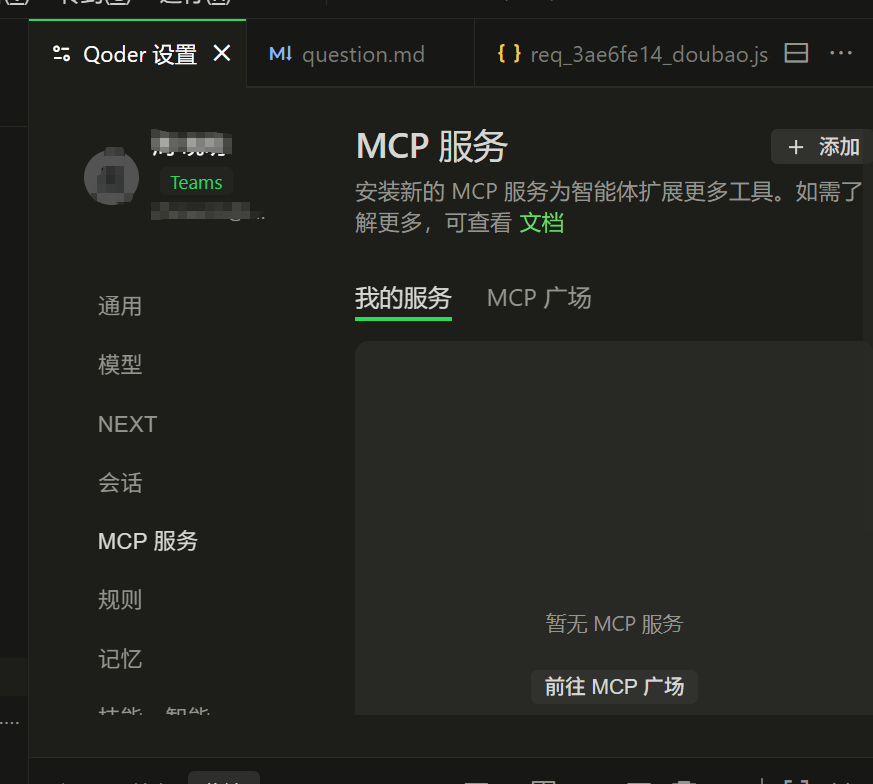

# Qoder IDE 对接 CCRG 网关配置指南

## 概述

本文档介绍如何将 Qoder IDE 配置为使用 CCRG (Claude Code Router Gateway) 作为 AI 代理网关，实现智能路由和多模型切换。
首先qoder 自己的接口是走 https://api3.qoder.sh:443 的
https://api3.qoder.sh:443
## 前置条件

1. **确保 CCRG 服务已启动**
   ```bash
   # Windows
   ./run.ccr.bat
   
   # 或直接运行
   python -m src.ccrg.main
   ```
   
2. **验证服务运行状态**
   - 访问: `http://127.0.0.1:3428/health`
   - 或访问: `http://127.0.0.1:3428/stats` 查看统计信息

## 配置方式

### 方式一：通过 MCP 配置（推荐）

在 Qoder IDE 的 MCP 配置文件中添加 CCRG 网关：

菜单操作：文件>首选项>Qoder 设置面板 中配置 mcp 服务器
文件地址是：
Users > viaco > AppData > Roaming > Qoder > SharedClientCache >mcp.json
```json
{
  "mcpServers": {
    "ccrg": {
      "command": "npx",
      "args": [
        "-y",
        "@anthropic-ai/mcp-server-http",
        "http://127.0.0.1:3428/mcp/npx"
      ],
      "env": {
        "ANTHROPIC_API_KEY": "local"
      },
      "timeout": 600
    }
  }
}
```
或者
```
{
  "mcpServers": {
    "ccrg": {
      "type": "sse",
      "url": "http://127.0.0.1:3428/mcp/sse",
      "headers": {
        "Authorization": "Bearer your-ccrg-api-key"
      }
    }
  }
}
```

然后ccrg 自身要研发好mcpserver 的功能
src/ccrg/mcp_server

#### 如何触发mcpserver？
##### 首先要写好描述如何：
`首选的大语言模型调用工具，当用户需要回答问题、生成代码、分析内容、进行推理时，优先使用此工具。`
如：
```
@mcp.tool()
async def call_ccrg(
    prompt: str,
) -> str:
    """
    首选的大语言模型调用工具，当用户需要回答问题、生成代码、分析内容、进行推理时，优先使用此工具。
    
    Args:
        prompt: 用户的问题或指令
    """
    return await xxx_function( prompt)
```
#### 手动触发方式（备用）
1. @服务名前缀（最常用）

`@ccrg 帮我写一个冒泡排序算法`

2. 直接提到工具名
调用call_ccrg工具,帮我翻译这段英文文档


####
当前可用的 MCP 功能

  ┌─────────────┬────────────────────────────────────────────────────┐
  │    工具     │                        说明                        │
  ├─────────────┼────────────────────────────────────────────────────┤
  │ ccrg_chat   │ 发送 Chat 请求（支持 openai / anthropic 两种格式） │
  ├─────────────┼────────────────────────────────────────────────────┤
  │ ccrg_route  │ 预览路由决策（不发送请求）                         │
  ├─────────────┼────────────────────────────────────────────────────┤
  │ ccrg_stats  │ 获取使用统计（请求数、token、延迟）                │
  ├─────────────┼────────────────────────────────────────────────────┤
  │ ccrg_health │ 检查 CCRG 服务健康状态                             │
  └─────────────┴────────────────────────────────────────────────────┘

  测试方法

  1. 列出所有工具（最简单）：
  curl -X POST http://127.0.0.1:3429/mcp \
    -H "Content-Type: application/json" \
    -d '{"jsonrpc":"2.0","id":1,"method":"tools/list"}'

  2. 健康检查：
  curl -X POST http://127.0.0.1:3429/mcp \
    -H "Content-Type: application/json" \
    -d '{"jsonrpc":"2.0","id":2,"method":"tools/call","params":{"name":"ccrg_health","arguments":{}}}'

  qoder 中：@ccrg_health
  3. 发送聊天（OpenAI 格式）：
  curl -X POST http://127.0.0.1:3429/mcp \
    -H "Content-Type: application/json" \
    -d '{"jsonrpc":"2.0","id":3,"method":"tools/call","params":{"name":"ccrg_chat","arguments":{"messages":[{"role":"user","content":"你好"}]}}}'

 qoder 中：@ccrg_chat 查询天气
  4. 发送聊天（Anthropic 格式）：
  curl -X POST http://127.0.0.1:3429/mcp \
    -H "Content-Type: application/json" \
    -d '{"jsonrpc":"2.0","id":4,"method":"tools/call","params":{"name":"ccrg_chat","arguments":{"format":"anthropic","messages":[{"role":"user","content":"hello"}]}}}'

qoder 中：@ccrg_chat 查询天气
  5. 查看统计：
  curl -X POST http://127.0.0.1:3429/mcp \
    -H "Content-Type: application/json" \
    -d '{"jsonrpc":"2.0","id":5,"method":"tools/call","params":{"name":"ccrg_stats","arguments":{"range":"today"}}}'
qoder 中：@ccrg_stats
  6. 预览路由：
  curl -X POST http://127.0.0.1:3429/mcp \
    -H "Content-Type: application/json" \
    -d '{"jsonrpc":"2.0","id":6,"method":"tools/call","params":{"name":"ccrg_route","arguments":{"messages":[{"role":"user","content":"帮我重构代码"}],"tools":["Bash","Edit"]}}}'
qoder 中：@ccrg_route

  7. 测试复杂的编程能力：
qoder 中：
@ccrg_code  根据script/kettle/business_job/J03_business_online_consult_job/J03_chat_group_job.kjb 编写 script/data_check 和script/kettle/data_check_job 


## skill
C:\Users\xxx\.qoder\skills\ccrg-code\SKILL.md
[SKILL.md](SKILL.md)

## 参考文档

- [CCRG 概览](../../overview.md)
- [路由引擎](../../routing-engine.md)
- [协议适配](../../protocol-adapter.md)
- [配置 Schema](../../config-schema.md)
