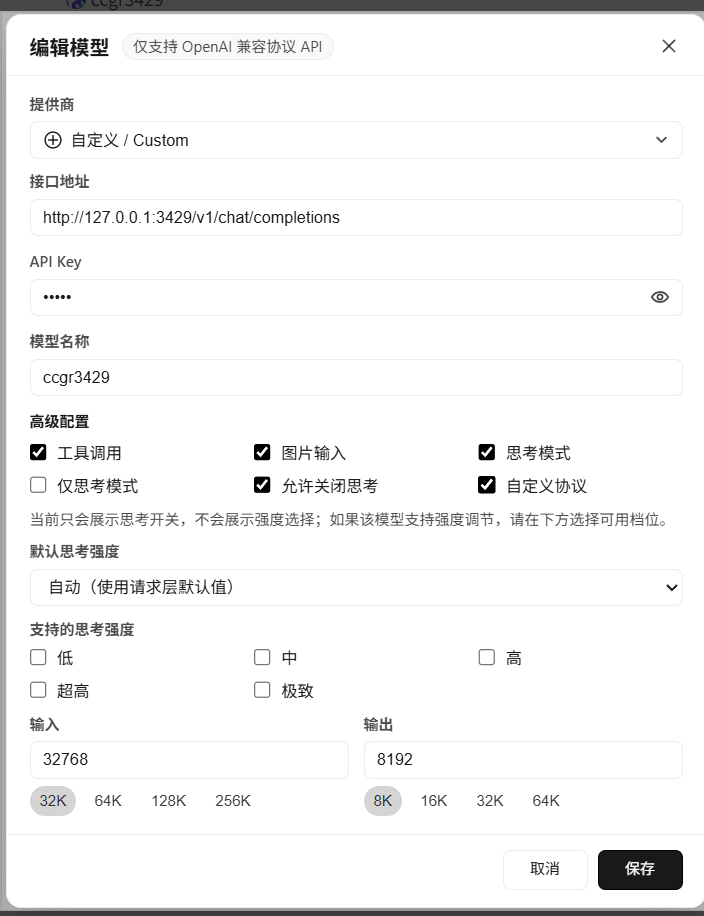

# Workbuddy 的配置 两种方式反复横跳？
models.json
v1
```
{
    "id": "local",
    "name": "local",
    "vendor": "Custom",
    "url": "http://127.0.0.1:3428/v1/",
    "apiKey": "local",
    "supportsToolCall": true,
    "supportsImages": true,
    "supportsReasoning": true,
    "useCustomProtocol": true
  }
```
V2（最新版是这样配置的）
```
{
    "id": "local",
    "name": "local",
    "vendor": "Custom",
    "url": "http://127.0.0.1:3428/v1/chat/completions",
    "apiKey": "local",
    "supportsToolCall": true,
    "supportsImages": true,
    "supportsReasoning": true,
    "useCustomProtocol": true
  }
```

curl 测试
```
  curl -X POST "http://127.0.0.1:3428/v1/chat/completions" \
    -H "Content-Type: application/json" \
    -d '{
      "model": "MiniMax-M2.7",
      "messages": [
        {"role": "user", "content": "帮我查一下今天的日期"}
      ],
      "tools": [
        {
          "type": "function",
          "function": {
            "name": "get_date",
            "description": "获取当前日期",
            "parameters": {"type": "object", "properties": {}, "required": []}
          }
        }
      ],
      "stream": false
    }'

```


可以配置
