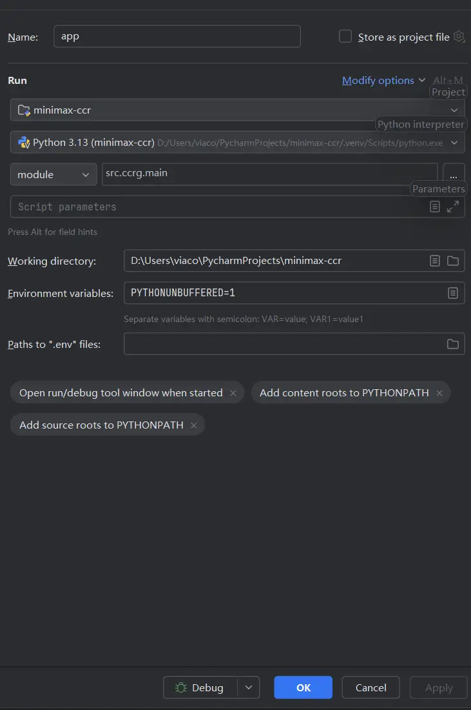

debug.Pycharm 

uvicorn>=26.1.1
# run函数修改

```
def run(host: str | None = None, port: int | None = None, config_path: str | None = None):
    import uvicorn
    import asyncio

    init_app(config_path)

    host = host or (_config.server.get("host", "127.0.0.1") if _config else "127.0.0.1")
    port = port or (_config.server.get("port", 3458) if _config else 3458)

    logger.info(f"Starting CCRG on {host}:{port}")

    # ✅✅✅ 调试绝杀：强制关闭 loop_factory ✅✅✅
    config = uvicorn.Config(
        app,
        host=host,
        port=port,
        log_level="info",
        timeout_graceful_shutdown=5
    )
    # 强制删掉冲突参数，让 PyCharm 调试无法报错
    config.loop_factory = None

    server = uvicorn.Server(config)
    asyncio.run(server.serve())
```


# Pycharm 配置

等效
D:\Users\xxx\PycharmProjects\minimax-ccr\.venv\Scripts\python.exe -X pycache_prefix=C:\Users\xxx\AppData\Local\JetBrains\PyCharm2025.1\cpython-cache "D:/Program Files/JetBrains/PyCharm 2025.1.3/plugins/python-ce/helpers/pydev/pydevd.py" --module --multiprocess --qt-support=auto --client 127.0.0.1 --port 49808 --file src.ccrg.main 

moudle:src.ccrg.main